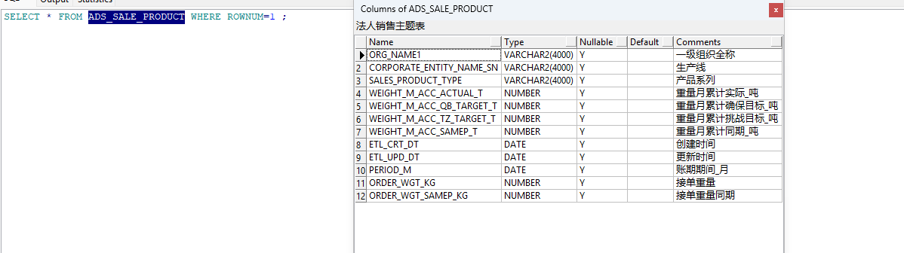

### 确认权限

> 

可以查看

### 找到目标表

### 找到kettle作业

### 修改
~~~sql

SELECT * FROM ADS_SALE_PRODUCT WHERE ROWNUM<20;

SELECT COUNT(1) FROM ADS_SALTGT_M ;
SELECT COUNT(1) FROM ADS_SALTGT_D ;

SELECT * FROM ADS_SALTGT_M  WHERE ROWNUM<20;
SELECT * FROM ADS_SALTGT_D  WHERE ROWNUM<20;

SELECT DISTINCT PRODUCE_COMPANY_NAME_SN  FROM ADS_SALTGT_D WHERE ROWNUM<50;

CREATE TABLE ADS_SALE_PRODUCT_TMP AS
       SELECT * FROM ADS_SALE_PRODUCT WHERE 1=0;

~~~

~~~SQL

DELETE FROM ADS_SALE_PRODUCT_TMP WHERE PERIOD_M = ADD_MONTHS(TRUNC(SYSDATE-1, 'MM'), -1);
INSERT INTO ADS_SALE_PRODUCT_TMP (
PERIOD_M,
ORG_NAME1,
CORPORATE_ENTITY_NAME_SN,
SALES_PRODUCT_TYPE,
WEIGHT_M_ACC_ACTUAL_T,
WEIGHT_M_ACC_QB_TARGET_T,
WEIGHT_M_ACC_TZ_TARGET_T,
WEIGHT_M_ACC_SAMEP_T,
ETL_CRT_DT,
ETL_UPD_DT,
ORDER_WGT_KG,
ORDER_WGT_SAMEP_KG
)
SELECT 
ADD_MONTHS(TRUNC(SYSDATE-1, 'MM'), -1) AS PERIOD_M,
平台 AS ORG_NAME1,
CASE 
    WHEN 产线 = '济南雅昌' AND 产品系列 = '管件类' THEN '济南雅昌-管件'
    WHEN 产线 = '济南雅昌' AND 产品系列 <> '管件类' THEN '济南雅昌-管材'
    -- WHEN 产线 = '玫德雅昌' AND 产品系列 = '管件类' THEN '德庆雅昌（管件）'
    -- WHEN 产线 = '玫德雅昌' AND 产品系列 IN ('支吊架', '槽钢') THEN '德庆雅昌（管件）'
    ELSE 产线 
END AS CORPORATE_ENTITY_NAME_SN,
产品系列 AS SALES_PRODUCT_TYPE,
SUM(发货月累计实际完成) AS WEIGHT_M_ACC_ACTUAL_T,
SUM(确保目标) AS WEIGHT_M_ACC_QB_TARGET_T,
SUM(挑战目标) AS WEIGHT_M_ACC_TZ_TARGET_T,
SUM(同比发货值) AS WEIGHT_M_ACC_SAMEP_T,
SYSDATE AS ETL_CRT_DT,
SYSDATE AS ETL_UPD_DT,
SUM(接单重量) AS 接单重量,
sum(同比接单重量) as 同比接单重量
FROM (
    SELECT 
        MARKET_TYPE 平台,
        PRODUCE_COMPANY_NAME_SN 产线,
        SALES_PRODUCT_TYPE 产品系列,
        MACC_COMPLETION 发货月累计实际完成,
        M_TGT 确保目标,
        0 AS 挑战目标,
        YOY_MACC_VAL 同比发货值,
     
        0 接单重量,
        0  同比接单重量
    FROM ADS_SALTGT_M 
    WHERE YPERIOD = ADD_MONTHS(TRUNC(SYSDATE-1, 'MM'), -1)
    AND OPS_TYPE = '发货' 
    AND INDEX_TYPE = '重量' 
    AND SALES_TARGET_TYPE = '确保目标'
    
    UNION ALL
    
    SELECT 
        MARKET_TYPE 平台,
        PRODUCE_COMPANY_NAME_SN 产线,
        SALES_PRODUCT_TYPE 产品系列,
        0 发货月累计实际完成,
        0 确保目标,
        M_TGT AS 挑战目标,
        0 同比发货值,
        0 接单重量,
        0  同比接单重量
    FROM ADS_SALTGT_M 
    WHERE YPERIOD = ADD_MONTHS(TRUNC(SYSDATE-1, 'MM'), -1)
    AND OPS_TYPE = '发货' 
    AND INDEX_TYPE = '重量' 
    AND SALES_TARGET_TYPE = '挑战目标'
 UNION ALL
     SELECT 
        MARKET_TYPE 平台,
        PRODUCE_COMPANY_NAME_SN 产线,
        SALES_PRODUCT_TYPE 产品系列,
        M_COMPLETION 发货月累计实际完成,
        M_TGT 确保目标,
        0 AS 挑战目标,
        YOY_M_VAL 同比发货值,
     
        0 接单重量,
        0  同比接单重量
    FROM ADS_SALTGT_d 
    WHERE OPS_TYPE = '发货' 
    AND INDEX_TYPE = '重量' 
    AND SALES_TARGET_TYPE = '确保目标'
    
    UNION ALL
    
    SELECT 
        MARKET_TYPE 平台,
        PRODUCE_COMPANY_NAME_SN 产线,
        SALES_PRODUCT_TYPE 产品系列,
        0 发货月累计实际完成,
        0 确保目标,
        M_TGT AS 挑战目标,
        0 同比发货值,
        0 接单重量,
        0  同比接单重量
    FROM ADS_SALTGT_d
    WHERE  OPS_TYPE = '发货' 
    AND INDEX_TYPE = '重量' 
    AND SALES_TARGET_TYPE = '挑战目标'

  
)

GROUP BY 
平台,
CASE 
    WHEN 产线 = '济南雅昌' AND 产品系列 = '管件类' THEN '济南雅昌-管件'
    WHEN 产线 = '济南雅昌' AND 产品系列 <> '管件类' THEN '济南雅昌-管材'
    -- WHEN 产线 = '玫德雅昌' AND 产品系列 = '管件类' THEN '德庆雅昌（管件）'
    -- WHEN 产线 = '玫德雅昌' AND 产品系列 IN ('支吊架', '槽钢') THEN '德庆雅昌（管件）'
    ELSE 产线 
END,
产品系列;

DELETE FROM  ADS_SALE_PRODUCT_TMP where ORG_NAME1 NOT in ('国内销售平台','海外销售平台','工业&电力BG') OR  ORG_NAME1  IS NULL;

~~~

