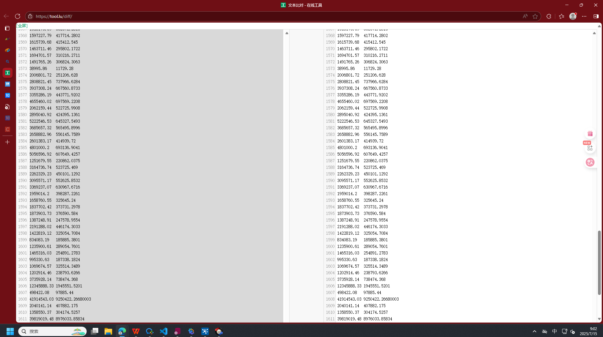

~~~sql

表名：DWD_SALE_DLY2_TMP   (新计算逻辑算出来的12月之前)
表名：DWD_SALE_DLY3_TMP    （新计算逻辑加上正式表12月之后）
SELECT COMPANY_SN, PERIOD,  SUM(AMT_M_FACT_OUTTAX),SUM(LINE_NET_WEIGHT)
FROM DWD_SALE_DLY2_TMP 
GROUP BY
    COMPANY_SN,
    PERIOD 
ORDER BY 1,2,3;

SELECT COMPANY_SN, PERIOD,  SUM(AMT_M_FACT_OUTTAX),SUM(LINE_NET_WEIGHT)
FROM TF_DWD_SALE_DLY
WHERE
    COMPANY_SN IN ('玫德艾瓦兹','迈克阀门','母公司','玫德威海','玫德雅昌','玫德庚辰','迈科管道','济南雅昌','山东晨晖')
    AND PERIOD < TO_DATE (20241201, 'YYMMDD')

GROUP BY
    COMPANY_SN,
    PERIOD
ORDER BY 1,2,3;
    

SELECT COMPANY_SN, PERIOD,  SUM(AMT_M_FACT_OUTTAX),SUM(LINE_NET_WEIGHT)
FROM DWD_SALE_DLY3_TMP
WHERE PERIOD >= TO_DATE (20241201, 'YYMMDD') 
GROUP BY
    COMPANY_SN,
    PERIOD 
ORDER BY 1,2,3;

SELECT COMPANY_SN, PERIOD,  SUM(AMT_M_FACT_OUTTAX),SUM(LINE_NET_WEIGHT)
FROM TF_DWD_SALE_DLY
WHERE
    COMPANY_SN IN ('玫德艾瓦兹','迈克阀门','母公司','玫德威海','玫德雅昌','玫德庚辰','迈科管道','济南雅昌','山东晨晖')
    AND PERIOD >= TO_DATE (20241201, 'YYMMDD')

GROUP BY
    COMPANY_SN,
    PERIOD
ORDER BY 1,2,3;

~~~

~~~SQL
CREATE TABLE DWD_SALE_DLY3_TMP AS(-----根据正式表创建九公司12月之后的数据
    SELECT * FORM TF_DWD_SALE_DLY 
    WHERE 
        COMPANY_SN IN ('玫德艾瓦兹','迈克阀门','母公司','玫德威海','玫德雅昌','玫德庚辰','迈科管道','济南雅昌','山东晨晖')
        AND PERIOD >= TO_DATE (20241201, 'YYMMDD')
)

INSERT INTO DWD_SALE_DLY3_TMP(---将新的计算逻辑算出的数据导入
    SELECT * FROM DWD_SALE_DLY2_TMP
)

---测试TF_DWD_SALE_DLY和

SELECT COMPANY_SN, PERIOD,  SUM(AMT_M_FACT_OUTTAX),SUM(LINE_NET_WEIGHT)
FROM DWD_SALE_DLY3_TMP 
GROUP BY
    COMPANY_SN,
    PERIOD 
ORDER BY 1,2,3;

SELECT COMPANY_SN, PERIOD,  SUM(AMT_M_FACT_OUTTAX),SUM(LINE_NET_WEIGHT)
FROM TF_DWD_SALE_DLY
WHERE
    COMPANY_SN IN ('玫德艾瓦兹','迈克阀门','母公司','玫德威海','玫德雅昌','玫德庚辰','迈科管道','济南雅昌','山东晨晖')

GROUP BY
    COMPANY_SN,
    PERIOD
ORDER BY 1,2,3;
    

~~~

